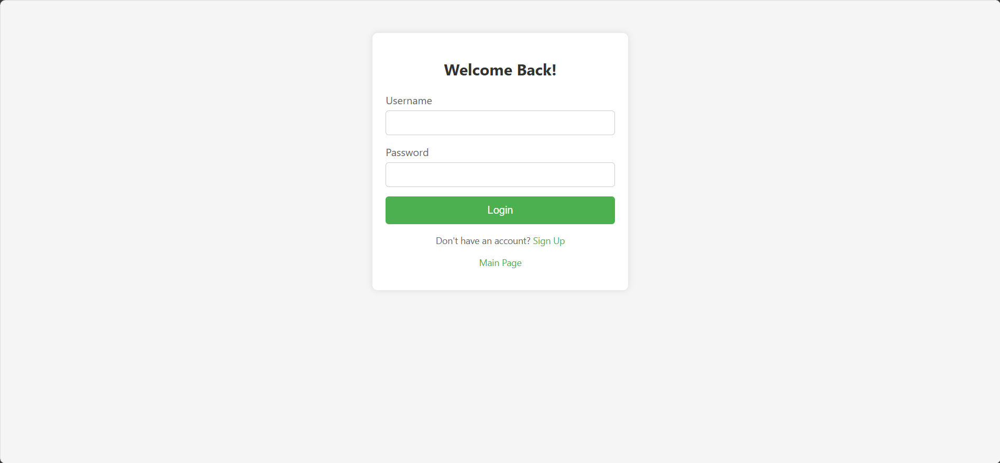
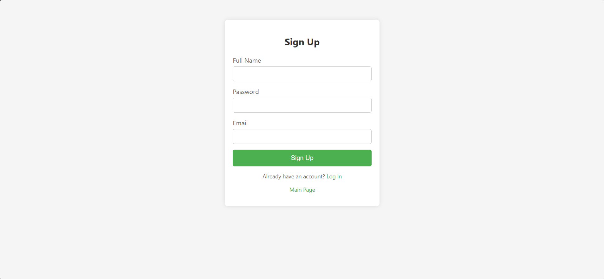
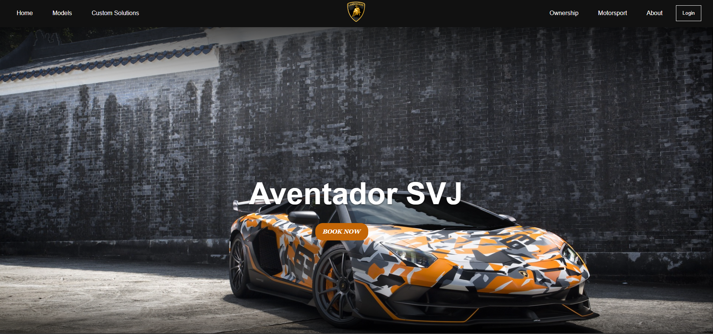
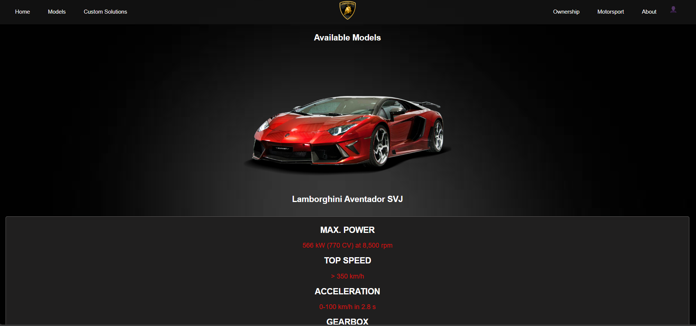
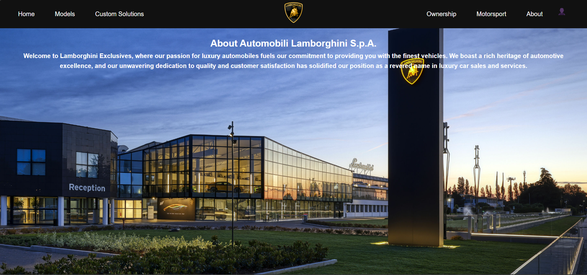

# Automobili Lamborghini Website

Welcome to the Automobili Lamborghini Website repository. This project is a web application designed to showcase the luxurious and high-performance cars of Lamborghini. The website provides an engaging user experience with detailed information about various Lamborghini models.

## Table of Contents

- Features
- Technologies Used
- Setup and Installation
- UI/UX
- Usage
- Contributing
- Contact

## Features

- **Responsive Design**: The website is fully responsive and looks great on all devices.
- **Dynamic Content**: Information about Lamborghini models is dynamically loaded.
- **User Authentication**: Secure login and registration system.
- **Admin Panel**: Allows admin users to manage car listings and user accounts.
- **Database Integration**: All data is stored and retrieved using a MySQL database.

## Technologies Used

- **Frontend**:
  - HTML5
  - CSS3
  - JavaScript

- **Backend**:
  - PHP

- **Database**:
  - MySQL

- **Development Tools**:
  - Visual Studio Code

## Setup and Installation

To get a local copy up and running, follow these simple steps.

### Prerequisites

- XAMPP or any local server environment with PHP and MySQL support
- Git

### Installation

1. **Clone the repository**:
   ```bash
   git clone https://github.com/mazen251/Automobili-Lamborghini-Website.git
   ```

2. **Navigate to the project directory**:
   ```bash
   cd Automobili-Lamborghini-Website
   ```

3. **Set up the database**:
   - Start your local server (e.g., XAMPP).
   - Create a new database named `lamborghini`.
   - Import the provided SQL file into the database.

4. **Configure database connection**:
   - Open `config.php` and update the database credentials as needed.

5. **Run the application**:
   - Place the project directory in your local server's root directory (e.g., `htdocs` for XAMPP).
   - Open your web browser and navigate to `http://localhost/Automobili-Lamborghini-Website`.
  
## UI/UX

### Login & SignUp



### Main Page


### Models


### About Us


## Usage

- **Login & SignUp**: Users can create a new account or log in to an existing account to access personalized features.
- **Main Page**: Browse through the homepage to see an overview of the Lamborghini models and other featured content.
- **Models**: View detailed information about various Lamborghini models.
- **About Us**: Learn more about the Lamborghini brand and its history.
- **Admin Panel**: Manage car listings and user accounts (admin access required).

## Contributing

Contributions are what make the open-source community such an amazing place to learn, inspire, and create. Any contributions you make are **greatly appreciated**.

1. Fork the Project
2. Create your Feature Branch (`git checkout -b feature/AmazingFeature`)
3. Commit your Changes (`git commit -m 'Add some AmazingFeature'`)
4. Push to the Branch (`git push origin feature/AmazingFeature`)
5. Open a Pull Request

## Contact

Mazen - [Mazen Walid](https://www.linkedin.com/in/mazen-walid-225582208/)

Project Link: [https://github.com/mazen251/Automobili-Lamborghini-Website](https://github.com/mazen251/Automobili-Lamborghini-Website)
